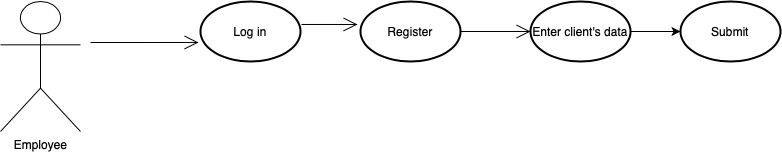
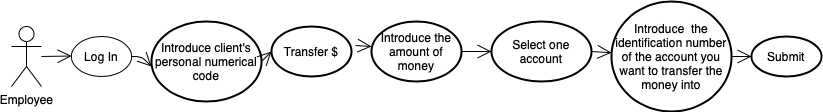
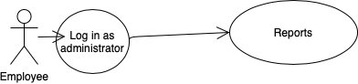
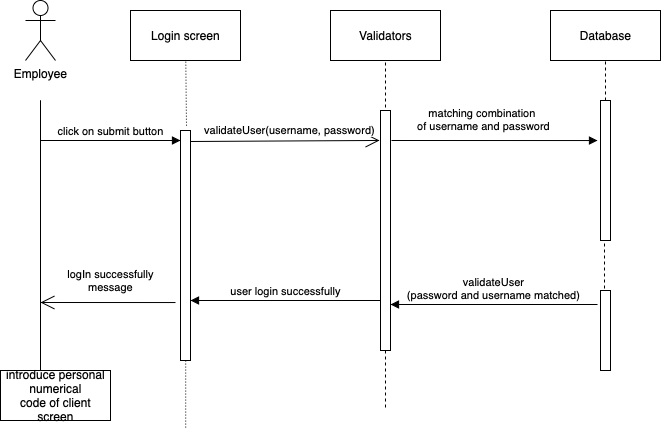
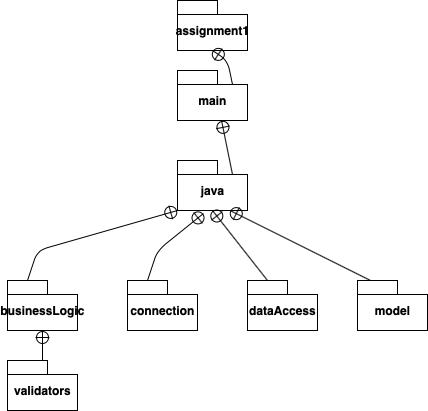
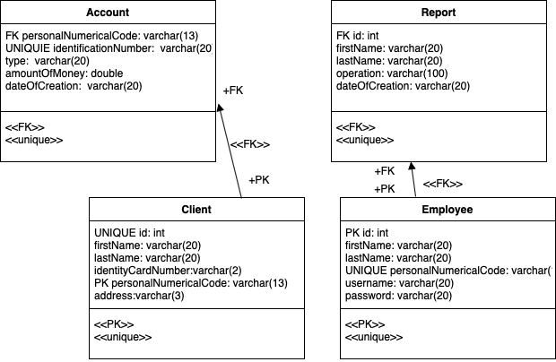

# Analysis and Design Document

# Requirement analysis

## Assignment Specification
Use JAVA/C# API to design and implement an application for the front desk employees of a bank. The application should have two types of users (a regular user represented by the front desk employee and an administrator user) which have to provide a username and a password in order to use the application.
## Function requirements
The regular user can perform the following operations:
* Add/update/view client information (name, identity card number, personal numerical code, address).
* Create/update/delete/view client account (account information: identification number, type, amount of money, date of creation).
* Tranfer money between accounts.
* Process utilities bills.

The administrator user can perform the following operations:
* Create/Update/View/Delete on employees’ information.
* Generate reports for a particular period containing the activities performed by an employee.

## Non-functional Requirements
- The data will be stored in a database. Use the Layers architectural pattern to organize your application. Use a domain logic pattern (transaction script or domain model) / a data source hybrid pattern (table module, active record) and a data source pure pattern (table data gateway, row data gateway, data mapper) most suitable for the application.
- do not use an Object Relational Mapper framework. Write the queries against the database in SQL.
- SQL script for creating and populating the database with initial values.
- the inputs of the application will be validated against invalid data before submitting the data and saving it in the database.
# Use-Case Model
## Use case 1

    * Use case: The goal of the use case is to demonstrate the add client operation.
    * Level: User-goal level.
    * Primary actor: Front desk employee (Regular user).
    * Main success scenario: Log In -> Register -> Enter client data -> Click the 
    "submit" button -> boom, the client is added into the database.
    * Extensions: 
        * fail: Log In -> Incorrect username/password.
  

## Use case 2

    * Use case: The goal of this use case is to demonstrate the operation of transfering money between two accounts
    * Level: User-goal level.
    * Primary actor: Front desk employee (Regular user).
    * Main success scenario: Log In -> Search client after personal numerical code -> Click the "Transfer $" button -> Introduce the amount of money -> Select one account -> Write the identification number of the acccount you want to transfer money into -> Click the "submit" button -> The operation is succesfull.
    * Extensions: 
        * fail:Log In -> Search client after personal numerical code -> Click the "Transfer $" button -> Select one account -> Write the identification number of the acccount you want to transfer money into -> Click the "submit" button -> You did not introduce the amount of money you want to transfer
        * fail: Log in -> Search client after personal numerical code -> Click the "Transfer $" button -> Introduce the amount of money -> Write the identification number of the acccount you want to transfer money into -> Click the "submit" button -> You did not select any account
        * fail: Log in -> Search client after personal numerical code -> Click the "Transfer $" button -> Introduce the amount of money -> Select one account -> Click the "submit" button -> You did not write the account you want to transfer the money into.
        

  
## Use case 3

    * Use case: The goal of this use case is to demonstrate the operation of generating a report for a particular period containing the activities performed by an employee.
    * Level: User-goal level. 
    * Primary actor: Administrator. 
    * Main success scenario: Log In (as administrator) -> Click "Reports" button -> View the pdf report. 
    * Extensions: 
        * fail: Log In -> Incorrect username or password. 
        * fail: Log In -> Click "Reports" button-> The employee is not in DB. 
  
# System Architectural Design

## Architectural Pattern Description
The application was structured on Layers architectural pattern, which helps to structure applications that can be decomposed into groups of subtasks, each group being at a particular level of abstraction. This is also known as n-tier architecture pattern, because components are organized in horizontal layers. This is the traditional method for designing most software and is meant to be self-independent. This means that all the components are interconnected but do not depend on each other. There are four layers in this architecture where each layer has a connection between modularity and component within them. From top to bottom, they are:
The presentation layer : It contains all categories related to the presentation layer.
The business layer : It contains business logic.
The persistence layer : It’s used for handling functions like object-relational mapping
The database layer : This is where all the data is stored.
By isolating the layers, they become independent from one another. For example, we are using an SQL server. If we would want to change the database to an Oracle server, this would cause a big impact on the database layer but it won't impact the other layers. One  of the most powerful featurs of this layered architecture pattern is the separation of concerns among components.
## Diagrams
# UML Sequence Diagrams
The following diagram was designed for the log in operation of a user (administrator or regular).
  
# Class Design

## Design Patterns Description
The layered architecture of this application was built using table module design pattern, for domain logic, and table gateway design pattern, for the data source. The strength of Table Module is that it allows you to package the data and behavior together and at the same time play to the strengths of a relational database. On the surface Table Module looks much like a regular object. The key difference is that it has no notion of an identity for the objects it's working with. The most obvious example of Table Module is the use of one for each table in the database. The Table Module may be an instance or it may be a collection of static methods. The advantage of an instance is that it allows you to initialize the Table Module with an existing record set, perhaps the result of a query. You can then use the instance to manipulate the rows in the record set. Instances also make it possible to use inheritance, so we can write a rush contract module that contains additional behavior to the regular contract. In this particular case, the table module is a domain logic pattern stating that a single instance can handle the business logic for all rows in a database table. The second design pattern, table gateway states that an instance handles all the rows in the table. A Table Data Gateway holds all the SQL for accessing a single table or view: selects, inserts, updates, and deletes. Other code calls its methods for all interaction with the database. 
Another design pattern that was used was Singleton, to create a single instance for the connection with the database.

## UML Class Diagram
  

# Package Diagram

# Deployment Diagram

# Data Model

# System Testing
There were no testing strategies or methods designed for this application. 

# Bibliography
- [Software Architecture Patterns by Mark Richards, Chapter 1](https://www.oreilly.com/library/view/software-architecture-patterns/9781491971437/ch01.html)
- [Catalog of Patterns of Enterprise Application Architecture](https://www.martinfowler.com/eaaCatalog/index.html)
