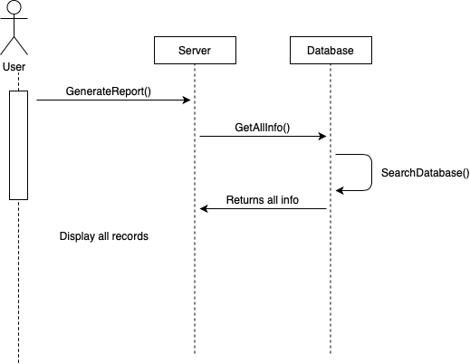

# Disneyland Specification
Use Java or C# to design and implement a desktop application for Disneyland. The application should have two types of users (a regular user and an administrator user) which have to provide a username and a password in order to use the application.

The regular user can perform the following operations:
* View list of activities, and search them by different properties.
* Register for open & available activities. An activity is like an OOP class, so it has multiple "instances" (occurrences). An example of activity is Horse Riding, which can have multiple slots open, at which users register.

The administrator can perform the following operations:
* CRUD on activities (different properties, like location, name, max users, availability).
* CRUD on regular users' information.
* Generate two types of report files, one in pdf format and one in txt or html format, with the activities, and registered users in them. The reports **need** to be saved in a **user-selected location** (not predefined by the application), similar on how one would save a file from Notepad.

# Elaboration – Iteration 1.1

## Domain Model
Domain Modeling is a way we describe and model the real world entities and the relationships between them, which collectively describes the problem's domain space. Basically, a domain model is a visual representation of real situation objects in a domain. It is compund by two words, each one used to fulfill system-level scenarios. A domain is an area of concern, used to refer to the area you are dealing with. The model is a diagram, for domain models the class diagram UML is mostly used. Derived from an understanding of system-level requirements, identifying domain entities and their relationships provides an effective basis for understanding and helps practitioners design systems for maintainability, testability, and incremental development. Because there is often a gap between understanding the problem domain and the interpretation of requirements, domain modeling is a primary modeling area in Agile development at scale. In this particulary case, at its worst business logic can be very complex. Rules and logic describe many different cases and slants of behavior, and it's this complexity that objects were designed to work with. The Domain Model creates a web of interconnected objects, where each object represents some meaningful individual, whether as large as a corporation or as small as a single line on an order form.

## Architectural Design

### Conceptual Architecture
A layered architectur, otherwise known as the n-tier architecture pattern, closely matches the traditional IT communication and organizational structures found in most companies, making it a natural choice for most business application development efforts. Components within the layered architecture pattern are organized into horizontal layers, each layer performing a specific role within the application (e.g., presentation logic or business logic). Each layer of the layered architecture pattern has a specific role and responsibility within the application. For example, a presentation layer would be responsible for handling all user interface and browser communication logic, whereas a business layer would be responsible for executing specific business rules associated with the request. Each layer in the architecture forms an abstraction around the work that needs to be done to satisfy a particular business request. For example, the presentation layer doesn’t need to know or worry about how to get customer data; it only needs to display that information on a screen in particular format. Similarly, the business layer doesn’t need to be concerned about how to format customer data for display on a screen or even where the customer data is coming from; it only needs to get the data from the persistence layer, perform business logic against the data (e.g., calculate values or aggregate data), and pass that information up to the presentation layer. This being said, one of the powerful features of the layered architecture pattern is the separation of concerns among components. Components within a specific layer deal only with logic that pertains to that layer. The layered architecture pattern is a solid general-purpose pattern, making it a good starting point for most applications, particularly when you are not sure what architecture pattern is best suited for your application.

### Package Design
[Create a package diagram]

### Component and Deployment Diagrams

# Elaboration – Iteration 1.2

## Design Model

### Dynamic Behavior
This section presents the dynamic behavior of the application using two significant scenarious. Both of the scenarious are universal and represented through diagrams, more exactly sequence and communication.  First of the scenario is represented by the log in or register operation, which is modified from the main specification as the user can also create his own account. The second scenario is represented by generating a report (in txt or pdf) in a user-preferred location, operation being performed by the administrator only.
#### Sequence Diagrams
##### Log In and Register

##### Generate report

#### Communication Diagrams
##### Log In and Register

##### Generate report

### Class Design
This application is based on two major design patterns, used in order to model the layers. The first one implemented is the Factory Method Design Pattern **mandatory**, also known as Virtual Constructor. Through this design pattern, we define an interface (abstract class can also be used) for creating an object but we let the subclasses decide which classes to instantiate. Therefore, in the process of generating a report we are using this pattern. Before realizing it's use, let's see the problem if we weren't using this design pattern, and we would connect the cliend code direcly to generating the report. This leads to many keyword and the code becomes cluttered, as it is tight cupled, and adding one more level it requires creating one more class and recompiling the client code. The solution offered by the Factory Method is creating a loosely coupled system. The other design pattern used for modelling the application is  Mediator, the communication between objects being encapsulated within a mediator object (repository).

### Data Model

### Unit Testing
Unit test the **users-related** controller(s)/view model(s) are performed using a testing framework (NUnit) and Mocking framework (e.g., Mockito, Moq) to mock dependencies on repositories/views. 
##### Use Case Diagram

# Elaboration – Iteration 2

## Architectural Design Refinement
From the first chapters is defined the architecture of this project, its architectural pattern being a client-server one. The application it is implemented using old methods such as sockets connections, and it is permitted to have on server and multiple clients. The application makes use of asynchronous mode, meaning that multiple clients can send messages to server. However, they will not wait for the server to respond, this defining the asynchronous implementation. The client side only contains user-related needs, such as controllers, views, and new packages meant to handle the messages and the objects sent. The logic of this application was transfered to the server side, so the controllers will only call a class whose purpose is only to build and send the messages. Server side, all the logic and database access through repository and business logic is transfered. The client and server share one common helper, the core, which containts the model and the structure of a message since it is personalized. As for the GRASP principles, they are covered with all the above modifications. Below are some diagrams that will prove the explanations given:

##### Conceptual architecture diagram

##### Component diagram

##### Deployment diagram

## Design Model Refinement
The final constraints came up with some new design patterns in order to keep in mind all the GRASP principles. Some of what i think of are definitely Command, because there is a Message object that incapsulates the command request between Client and Server, this being transposed into a Mediator, the core project, meant to be a middle way between Client and Server. Obviously to manage the data and request there are algorithms that could take us to a Strategy design pattern. The last constraints were meant to refine the application design and arhchitescture, assuring that all basic principles are being taken in stock.

# Construction and Transition

## System Testing
The application it is tested in a percentaje of over 60%, thus almost all operations were tested. From the basic tests which include testing the database, they took all over the place with all CRUD operations on user and activities either, registering to activities, unregistering, and also the search operations which was made with different criteria. The application also passed the resharper test, whose warnings were only about typo's and empty constructors. 

## Future improvements
As a future improvement, it should be studied the AppKit controllers behaviour, synchronised the threads in a better way so that the main UI thread is never blocked. It is a complex project and the future improvements would be only as final touches.

# Bibliography
- [Architectural Styles](https://docs.microsoft.com/en-us/azure/architecture/guide/architecture-styles/)
- [Architectural Patterns and Styles](https://msdn.microsoft.com/en-us/library/ee658117.aspx)
- [Design Patterns](https://sourcemaking.com/design_patterns)
- [Online diagram drawing software](https://yuml.me/) ([Samples](https://yuml.me/diagram/scruffy/class/samples))
- [Yet another online diagram drawing software](https://www.draw.io)
