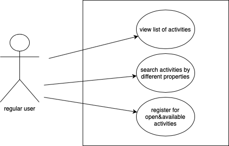
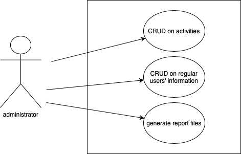

# Disneyland Use Case Model

# Use-Cases Identification
In this section, there will be described some of the most important use-cases and illustrated using UML diagrams. The actors will be represented by a user, which can be regular or administrator. Both have to provide a username and password in order to use the application.  

## Use case 1- regular user use-case
* **Use case**: highlighting the operations that can be performed by a regular user.
* **Level**: user-goal level.
* **Primary actor**: the actor that initiates this use case is a regular user.
* **Main success scenario**:  the main succes scenario starts with the regular user that provides a valid combination of username and password, which leads to logging in successfully; afterwards, the actor can view the list of activities and search them by different properties, choosing the desired activity.
* **Extensions**: there can be a successful scenario and also a few failures, refering to providing an invalid combination of username and password, not finding a certain activity by not providing enough properties/ providing a wrong property, not having enough space for the user at the desired activity ( the activity is no longer available).

## Use case 2- administrator use-case
* **Use case**: highlighting the operations that can be performed by an administrator.
* **Level**: user-goal.
* **Primary actor**: the actor that initiates this use-case must be the administrator.
* **Main success scenario**: as in the regular user use-case, the administrator has to provide a valid combination of username and password in order to obtain a successfully scenario; afterwards, he can perform specific operations such as CRUD on activities, CRUD on regular users' information and generate report files. 
* **Extensions**: failures scenarios can be achieved, as in the regular user use-case, by entering an invalid combination of username and password, to which are added the cases in which the system can not acces the database, the user already exists in the database, or the report files can not be saved to a specific location.

# UML Use-Case Diagrams
* This section will illustrate the UML use-case diagrams for the scenarios described in the previous section.

## Diagram 1

## Diagram 2

# Bibliography

* [Online diagram drawing software](https://yuml.me/) ([Samples](https://yuml.me/diagram/nofunky/usecase/samples))
* [Yet another online diagram drawing software](https://www.draw.io)
